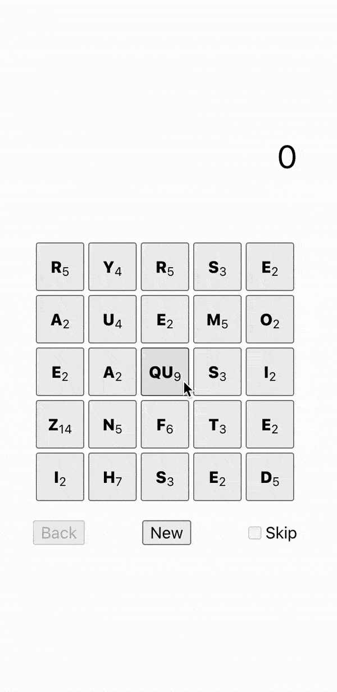

# Letter Threader

String words together from a grid of random letters.

You can play it on [GitHub Pages](https://benrosen.github.io/letter-threader/)
or [itch.io](https://brosen.itch.io/letter-threader)